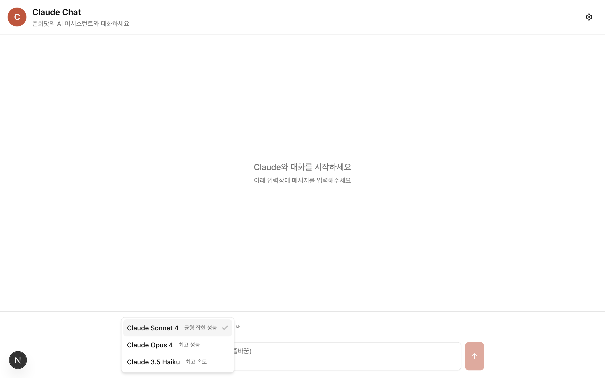
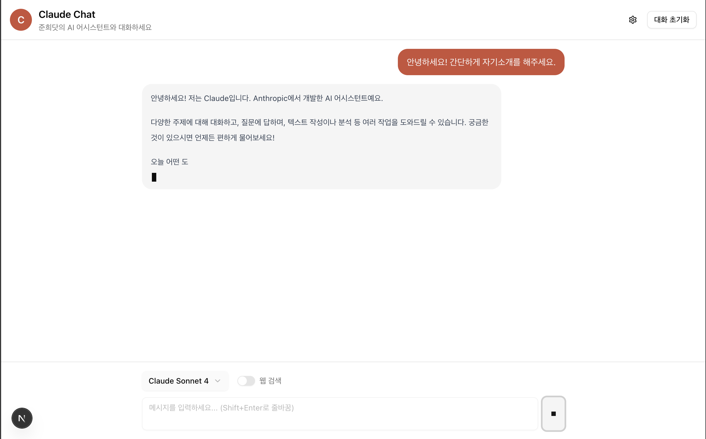
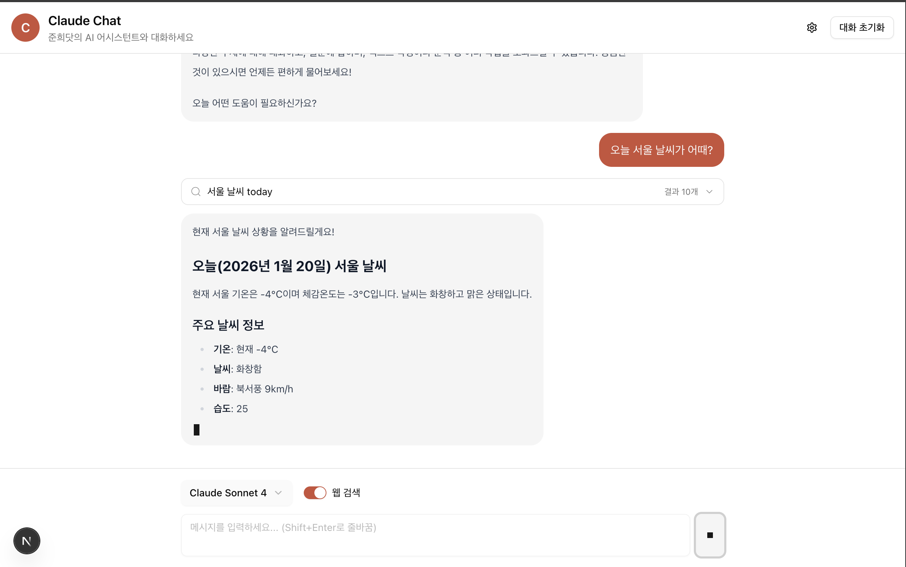

# Claude AI 챗봇을 만들며 배우는 LLM의 SSE 스트리밍 전략

## 들어가며

ChatGPT나 Claude를 사용해 보셨다면 텍스트가 한 글자씩 타이핑되듯 출력되는 것을 경험해 보셨을 것입니다. 이런 UX는 단순히 시각적 효과가 아닙니다. LLM이 토큰 단위로 응답을 생성하는 특성을 활용한 **스트리밍 응답** 방식입니다.

LLM 응답은 수 초에서 수십 초까지 걸릴 수 있습니다. 사용자가 빈 화면을 보며 기다리게 하는 것보다, 생성되는 즉시 텍스트를 보여주는 것이 훨씬 나은 경험을 제공합니다.

이 글에서는 Next.js와 React를 사용해 Claude API 기반 챗봇을 직접 구현하면서 **SSE(Server-Sent Events)** 스트리밍의 동작 원리와 실전 구현 전략을 살펴봅니다.


## 실행 방법

```md
# 다운로드

pnpm install

# 테스트 코드 실행

pnpm test

# 개발 환경 실행

pnpm dev

# 빌드

pnpm build

# 빌드 후 실행

pnpm start
```

### 이 글의 대상

- LLM API를 활용한 서비스 개발에 관심 있는 개발자
- 실시간 스트리밍 UI를 구현하고 싶은 프론트엔드 개발자
- Next.js 환경에서 SSE를 적용하고 싶은 개발자

---

## 1. 왜 LLM 응답에 SSE가 필요한가?

### 일반 HTTP 요청의 한계

일반적인 REST API 호출 방식을 생각해 봅시다.

```
클라이언트 → 요청 → 서버 → (처리) → 완전한 응답 → 클라이언트
```

이 방식에서 클라이언트는 서버가 **모든 처리를 완료할 때까지** 기다려야 합니다. LLM의 경우 긴 응답을 생성하는 데 10초 이상 걸릴 수 있어, 사용자는 그동안 아무것도 볼 수 없습니다.

### SSE의 장점

SSE(Server-Sent Events)는 서버에서 클라이언트로 **단방향 실시간 데이터 스트림**을 전송하는 HTTP 기반 프로토콜입니다.

```
클라이언트 → 요청 → 서버 → 데이터1 → 데이터2 → ... → 데이터N → 종료
                          ↓         ↓              ↓
                       즉시 표시  즉시 표시      즉시 표시
```

LLM은 토큰(단어 또는 단어 조각) 단위로 응답을 생성합니다. SSE를 사용하면 토큰이 생성될 때마다 즉시 클라이언트에 전달할 수 있습니다.

### WebSocket과의 비교

| 특성          | SSE                        | WebSocket          |
| ------------- | -------------------------- | ------------------ |
| 통신 방향     | 단방향 (서버 → 클라이언트) | 양방향             |
| 프로토콜      | HTTP                       | WS (별도 프로토콜) |
| 연결 복잡도   | 낮음                       | 높음               |
| 자동 재연결   | 브라우저 내장 지원         | 직접 구현 필요     |
| LLM 응답 용도 | **적합**                   | 과도함             |

LLM 응답 스트리밍은 서버에서 클라이언트로의 단방향 전송이므로 SSE가 적합합니다. WebSocket은 채팅방처럼 **양방향 실시간 통신**이 필요한 경우에 사용합니다.

---

## 2. SSE 프로토콜 이해하기

### SSE 메시지 형식

SSE는 텍스트 기반의 단순한 프로토콜입니다. 각 이벤트는 `field: value` 형식으로 전송됩니다.

```
data: {"type": "content_block_delta", "delta": {"text": "안녕"}}

data: {"type": "content_block_delta", "delta": {"text": "하세요"}}

data: [DONE]
```

**주요 필드:**

- `data`: 이벤트 데이터 (필수)
- `event`: 이벤트 타입 (선택)
- `id`: 이벤트 ID (선택, 재연결 시 사용)
- `retry`: 재연결 대기 시간 (선택)

각 이벤트는 빈 줄(`\n\n`)로 구분됩니다.

### HTTP 응답 헤더

SSE 응답에는 다음 헤더가 필요합니다.

```typescript
return new Response(stream, {
  headers: {
    'Content-Type': 'text/event-stream', // SSE 명시
    'Cache-Control': 'no-cache', // 캐싱 방지
    Connection: 'keep-alive', // 연결 유지
  },
});
```

### 브라우저에서 SSE 소비하기: EventSource vs fetch

브라우저에서 SSE를 소비하는 방법은 두 가지입니다.

**1. EventSource API (전통적인 방식)**

```javascript
const eventSource = new EventSource('/api/notifications');

eventSource.onmessage = (event) => {
  console.log(event.data); // 자동 파싱
};

eventSource.onerror = () => {
  // 자동 재연결 시도
};

eventSource.close(); // 연결 종료
```

`EventSource`는 브라우저 내장 API로, 이벤트 파싱과 재연결을 자동으로 처리합니다.

**2. fetch + ReadableStream (이 글에서 사용하는 방식)**

```javascript
const response = await fetch('/api/chat', {
  method: 'POST',
  body: JSON.stringify({ messages }),
  signal: abortController.signal,
});

const reader = response.body.getReader();
// 수동으로 스트림 읽기 및 파싱...
```

**왜 LLM API에서는 fetch를 사용해야 할까요?**

| 특성              | EventSource    | fetch + ReadableStream |
| ----------------- | -------------- | ---------------------- |
| HTTP 메서드       | **GET만 지원** | POST, GET 등 모두 지원 |
| 요청 본문         | 전송 불가      | JSON 등 전송 가능      |
| 헤더 커스터마이징 | 불가           | 가능                   |
| 이벤트 파싱       | 자동           | 수동 (버퍼 기반)       |
| 자동 재연결       | 내장 지원      | 직접 구현 필요         |
| 중단 제어         | `.close()`     | `AbortController`      |

LLM API는 대화 히스토리(`messages` 배열)를 **POST 본문으로 전송**해야 합니다. `EventSource`는 GET 요청만 지원하므로 사용할 수 없습니다. 따라서 이 글에서는 `fetch` + `ReadableStream` 방식으로 구현합니다.

**LLM SSE의 특징: 요청-응답 패턴**

일반적인 SSE는 한 번 연결하면 서버가 지속적으로 이벤트를 푸시하는 **장기 연결** 방식입니다. 반면 LLM API의 SSE는 **요청-응답 패턴**을 따릅니다.

```
일반 SSE (알림, 피드):
연결 ─────────────────────────────────────────▶ (계속 유지)
       ← 이벤트1  ← 이벤트2  ← 이벤트3  ...

LLM SSE (메시지 단위):
요청1 ──▶ ← 토큰 ← 토큰 ← 토큰 ← [DONE] ──▶ 연결 종료
요청2 ──▶ ← 토큰 ← 토큰 ← [DONE] ──▶ 연결 종료
```

하나의 메시지 생성이 완료되면(`message_stop` 이벤트) 연결을 명시적으로 종료합니다. 이 방식은 다음과 같은 이점이 있습니다.

- **리소스 관리**: 불필요한 연결을 유지하지 않아 서버/클라이언트 리소스 절약
- **에러 격리**: 한 요청의 문제가 다른 요청에 영향을 주지 않음
- **상태 명확성**: 각 요청의 시작과 끝이 명확하여 UI 상태 관리가 단순해짐

> **참고**: 단순한 알림이나 실시간 피드처럼 서버에서 지속적으로 데이터를 푸시하는 경우에는 `EventSource`가 더 간편합니다.

---

## 3. 전체 아키텍처 설계

Claude API를 직접 브라우저에서 호출하면 API 키가 노출됩니다. 따라서 백엔드를 통한 **프록시 패턴**이 필요합니다.

```
┌─────────────┐      ┌─────────────┐      ┌─────────────┐
│  브라우저    │ ──▶   │  Next.js    │ ──▶  │  Claude     │
│  (React)    │      │  API Route  │      │  API        │
│             │ ◀──  │  (프록시)     │ ◀──  │             │
└─────────────┘      └─────────────┘      └─────────────┘
     fetch            ReadableStream      SSE Stream
   + AbortController
```

**데이터 흐름:**

1. 브라우저에서 사용자 메시지와 함께 API Route 호출
2. API Route가 Claude API에 스트리밍 요청
3. Claude API의 SSE 응답을 그대로 클라이언트에 전달
4. 브라우저에서 스트림을 읽어 UI 업데이트



---

## 4. 백엔드 구현: SSE 프록시

### API Route 기본 구조

Next.js App Router의 Route Handler로 SSE 프록시를 구현합니다.

`src/app/api/chat/route.ts`

```typescript
import { NextRequest } from 'next/server';

export async function POST(request: NextRequest) {
  const body = await request.json();
  const { messages, model } = body;

  // 1. Claude API 호출 (스트리밍 모드)
  const response = await fetch('https://api.anthropic.com/v1/messages', {
    method: 'POST',
    headers: {
      'Content-Type': 'application/json',
      'x-api-key': process.env.ANTHROPIC_API_KEY!,
      'anthropic-version': '2023-06-01',
    },
    body: JSON.stringify({
      model: model || 'claude-sonnet-4-20250514',
      max_tokens: 4096,
      stream: true, // 스트리밍 활성화
      messages,
    }),
  });

  if (!response.ok) {
    const errorText = await response.text();
    return new Response(JSON.stringify({ error: errorText }), {
      status: response.status,
    });
  }

  // 2. ReadableStream으로 SSE 프록시 구축
  const stream = new ReadableStream({
    async start(controller) {
      const reader = response.body?.getReader();
      if (!reader) {
        controller.close();
        return;
      }

      const decoder = new TextDecoder();

      try {
        while (true) {
          const { done, value } = await reader.read();
          if (done) break;

          // Claude API 응답을 그대로 클라이언트에 전달
          const chunk = decoder.decode(value, { stream: true });
          controller.enqueue(new TextEncoder().encode(chunk));
        }
      } finally {
        controller.close();
      }
    },
  });

  // 3. SSE 헤더와 함께 응답
  return new Response(stream, {
    headers: {
      'Content-Type': 'text/event-stream',
      'Cache-Control': 'no-cache',
      Connection: 'keep-alive',
    },
  });
}
```

### 코드 설명

1. **`stream: true`**: Claude API에 스트리밍 모드를 요청합니다. 이 옵션이 없으면 전체 응답이 완료될 때까지 기다립니다.

2. **`ReadableStream`**: Web Streams API의 읽기 가능한 스트림입니다. `start` 메서드 내에서 데이터를 점진적으로 `enqueue`합니다.

3. **`TextDecoder`/`TextEncoder`**: 바이너리 데이터(`Uint8Array`)와 문자열 간 변환을 담당합니다. `{ stream: true }` 옵션은 멀티바이트 문자(한글 등)가 청크 경계에서 잘리는 문제를 방지합니다.

---

## 5. 프론트엔드 구현: 스트림 소비

### Custom Hook 설계

스트리밍 로직을 재사용 가능한 훅으로 분리합니다.

`src/hooks/useStreamResponse.ts`

```typescript
'use client';

import { useState, useCallback, useRef } from 'react';

interface UseStreamResponseReturn {
  streamText: string;
  isStreaming: boolean;
  error: string | null;
  startStream: (
    messages: Array<{ role: string; content: string }>,
  ) => Promise<string>;
  abortStream: () => void;
}

export function useStreamResponse(): UseStreamResponseReturn {
  const [streamText, setStreamText] = useState('');
  const [isStreaming, setIsStreaming] = useState(false);
  const [error, setError] = useState<string | null>(null);
  const abortControllerRef = useRef<AbortController | null>(null);

  const abortStream = useCallback(() => {
    if (abortControllerRef.current) {
      abortControllerRef.current.abort();
      abortControllerRef.current = null;
    }
  }, []);

  const startStream = useCallback(
    async (messages) => {
      // 이전 스트림 중단
      abortStream();
      abortControllerRef.current = new AbortController();

      setIsStreaming(true);
      setError(null);
      setStreamText('');

      let fullText = '';

      try {
        const response = await fetch('/api/chat', {
          method: 'POST',
          headers: { 'Content-Type': 'application/json' },
          body: JSON.stringify({ messages }),
          signal: abortControllerRef.current.signal, // 중단 시그널 연결
        });

        if (!response.ok) {
          throw new Error(`HTTP ${response.status}`);
        }

        // ReadableStream 소비
        const reader = response.body?.getReader();
        if (!reader) throw new Error('No response body');

        const decoder = new TextDecoder();
        let buffer = '';

        while (true) {
          const { done, value } = await reader.read();
          if (done) break;

          // 청크를 버퍼에 추가
          buffer += decoder.decode(value, { stream: true });

          // 줄 단위로 파싱
          const lines = buffer.split('\n');
          buffer = lines.pop() || ''; // 마지막 불완전한 줄은 버퍼에 유지

          for (const line of lines) {
            if (line.startsWith('data: ')) {
              const data = line.slice(6).trim();
              if (data === '[DONE]') continue;

              try {
                const event = JSON.parse(data);

                // 텍스트 델타 이벤트 처리
                if (
                  event.type === 'content_block_delta' &&
                  event.delta?.type === 'text_delta'
                ) {
                  fullText += event.delta.text;
                  setStreamText(fullText);
                }
              } catch {
                // JSON 파싱 실패 무시
              }
            }
          }
        }

        return fullText;
      } catch (err) {
        if (err instanceof Error && err.name === 'AbortError') {
          return fullText; // 사용자가 중단한 경우
        }
        setError(err instanceof Error ? err.message : 'Unknown error');
        throw err;
      } finally {
        setIsStreaming(false);
        abortControllerRef.current = null;
      }
    },
    [abortStream],
  );

  return { streamText, isStreaming, error, startStream, abortStream };
}
```

### 핵심 파싱 로직 상세 설명

SSE 스트림을 올바르게 파싱하려면 **버퍼 기반 처리**가 필요합니다.

```typescript
buffer += decoder.decode(value, { stream: true });
const lines = buffer.split('\n');
buffer = lines.pop() || ''; // 마지막 불완전한 줄은 버퍼에 유지
```

**왜 버퍼가 필요한가?**

네트워크에서 데이터는 임의의 크기로 도착합니다. 하나의 SSE 이벤트가 여러 청크에 걸쳐 도착할 수 있습니다.

```
청크 1: "data: {\"type\": \"content_bl"
청크 2: "ock_delta\", \"delta\": {\"text\": \"안녕\"}}\n\n"
```

버퍼를 사용해 불완전한 줄을 보관하고, 다음 청크와 합쳐서 완전한 이벤트를 만들어야 합니다.

### Claude API 이벤트 타입

Claude API는 다양한 이벤트 타입을 전송합니다.

| 이벤트 타입           | 설명                   |
| --------------------- | ---------------------- |
| `message_start`       | 메시지 시작            |
| `content_block_start` | 컨텐츠 블록 시작       |
| `content_block_delta` | 텍스트 델타 (핵심)     |
| `content_block_stop`  | 컨텐츠 블록 종료       |
| `message_delta`       | 메시지 메타데이터 변경 |
| `message_stop`        | 메시지 종료            |

실제 텍스트는 `content_block_delta` 이벤트의 `delta.text`에 담겨 옵니다.

```json
{
  "type": "content_block_delta",
  "index": 0,
  "delta": {
    "type": "text_delta",
    "text": "안녕하세요"
  }
}
```

### 화면에 스트리밍 텍스트 렌더링하기

파싱한 `streamText`를 React 컴포넌트에서 렌더링하는 방법입니다.

```tsx
// src/components/chat/MessageList.tsx

interface MessageListProps {
  messages: Message[];
  streamingContent: string; // 스트리밍 중인 텍스트
  isLoading: boolean;
}

export function MessageList({
  messages,
  streamingContent,
  isLoading,
}: MessageListProps) {
  return (
    <div className='flex flex-col gap-4'>
      {/* 완료된 메시지들 */}
      {messages.map((message) => (
        <MessageBubble key={message.id} message={message} />
      ))}

      {/* 스트리밍 중인 메시지 (실시간 타이핑 효과) */}
      {isLoading && (
        <div className='bg-gray-100 rounded-lg p-4'>
          {streamingContent || <LoadingDots />}
        </div>
      )}
    </div>
  );
}
```

**타이핑 효과의 원리:**

1. `useStreamResponse` 훅에서 `setStreamText(fullText)`가 호출될 때마다 React 상태가 변경됩니다.
2. 상태 변경은 컴포넌트 리렌더링을 트리거합니다.
3. 토큰이 도착할 때마다 (수십 ms 간격) 상태가 업데이트되므로 사용자에게는 한 글자씩 타이핑되는 것처럼 보입니다.

```
토큰 도착 → setStreamText("안") → 리렌더링 → 화면: "안"
토큰 도착 → setStreamText("안녕") → 리렌더링 → 화면: "안녕"
토큰 도착 → setStreamText("안녕하세요") → 리렌더링 → 화면: "안녕하세요"
```

> **팁**: 마크다운 렌더링이 필요한 경우 `react-markdown` 라이브러리를 사용하면 스트리밍 중에도 실시간으로 마크다운이 렌더링됩니다.



---

## 6. 실전 고려사항

### 6.1 AbortController로 스트림 중단

사용자가 "정지" 버튼을 누르면 진행 중인 스트림을 즉시 중단해야 합니다.

```typescript
const abortControllerRef = useRef<AbortController | null>(null);

// 스트림 시작 시
abortControllerRef.current = new AbortController();
await fetch('/api/chat', {
  signal: abortControllerRef.current.signal,
  // ...
});

// 중단 시
const abortStream = () => {
  abortControllerRef.current?.abort();
};
```

`AbortController.abort()`를 호출하면 `fetch`가 `AbortError`를 throw합니다. 이를 catch해서 정상적인 중단으로 처리합니다.

```typescript
} catch (err) {
  if (err instanceof Error && err.name === "AbortError") {
    return fullText;  // 정상 중단, 에러 아님
  }
  setError(err.message);
}
```

### 6.2 에러 처리 전략

API 에러는 크게 세 단계에서 발생합니다.

**1단계: HTTP 에러 (fetch 실패)**

```typescript
if (!response.ok) {
  const errorData = await response.json();
  // 에러 타입에 따른 사용자 친화적 메시지
  switch (errorData.type) {
    case 'rate_limit_error':
      throw new Error('요청 한도를 초과했습니다. 잠시 후 다시 시도해주세요.');
    case 'authentication_error':
      throw new Error('API 인증에 실패했습니다.');
    default:
      throw new Error(errorData.message);
  }
}
```

**2단계: 스트림 중 에러**

Claude API는 스트리밍 중에도 에러 이벤트를 전송할 수 있습니다.

```typescript
if (event.type === 'error') {
  throw new Error(event.error?.message || '스트리밍 중 에러 발생');
}
```

**3단계: 네트워크 에러**

```typescript
try {
  const { done, value } = await reader.read();
} catch (err) {
  // 네트워크 연결 끊김 등
  setError('네트워크 연결이 끊어졌습니다.');
}
```

### 6.3 타입 안전성

TypeScript로 이벤트 타입을 정의하면 안전하게 파싱할 수 있습니다.

```typescript
// src/types/chat.ts

export interface StreamEvent {
  type: string;
  index?: number;
  delta?: {
    type: string;
    text?: string;
  };
  content_block?: {
    type: string;
    text?: string;
  };
}

export interface Message {
  id: string;
  role: 'user' | 'assistant';
  content: string;
  createdAt: Date;
}
```

---

## 7. 웹 검색 기능 통합

Claude API는 `web_search` 도구를 통해 실시간 웹 검색 기능을 제공합니다. 스트리밍 응답에 검색 결과를 통합하는 방법을 살펴봅니다.



### 7.1 API Route 수정

웹 검색을 활성화하려면 `tools` 배열과 베타 헤더를 추가합니다.

```typescript
// src/app/api/chat/route.ts

export async function POST(request: NextRequest) {
  const { messages, model, webSearchEnabled } = await request.json();

  // API 요청 본문 구성
  const requestBody: Record<string, unknown> = {
    model: model || 'claude-sonnet-4-20250514',
    max_tokens: 4096,
    stream: true,
    messages,
  };

  // 웹 검색이 활성화된 경우 도구 추가
  if (webSearchEnabled) {
    requestBody.tools = [
      {
        type: 'web_search_20250305',
        name: 'web_search',
        max_uses: 5, // 한 응답당 최대 검색 횟수
      },
    ];
  }

  const headers: Record<string, string> = {
    'Content-Type': 'application/json',
    'x-api-key': process.env.ANTHROPIC_API_KEY!,
    'anthropic-version': '2023-06-01',
  };

  // 웹 검색 사용 시 베타 헤더 추가
  if (webSearchEnabled) {
    headers['anthropic-beta'] = 'web-search-2025-03-05';
  }

  const response = await fetch('https://api.anthropic.com/v1/messages', {
    method: 'POST',
    headers,
    body: JSON.stringify(requestBody),
  });

  // ... 이하 스트림 프록시 코드 동일
}
```

### 7.2 웹 검색 관련 이벤트 타입

웹 검색이 활성화되면 기존 텍스트 이벤트 외에 추가 이벤트가 전송됩니다.

| 이벤트                | 블록 타입                  | 설명                    |
| --------------------- | -------------------------- | ----------------------- |
| `content_block_start` | `server_tool_use`          | 검색 도구 호출 시작     |
| `content_block_delta` | `input_json_delta`         | 검색 쿼리 (점진적 JSON) |
| `content_block_start` | `web_search_tool_result`   | 검색 결과 반환          |
| `content_block_delta` | `text_delta` + `citations` | 텍스트와 인용 정보      |

**검색 흐름:**

```
1. server_tool_use 시작 → 검색 쿼리 파싱
2. web_search_tool_result → 검색 결과 (URL, 제목)
3. text_delta + citations → 검색 결과를 인용한 응답 텍스트
```

### 7.3 프론트엔드 이벤트 파싱 확장

검색 쿼리와 결과를 파싱하도록 훅을 확장합니다.

```typescript
// src/hooks/useStreamResponse.ts (확장)

interface SearchQuery {
  query: string;
  results: { url: string; title: string }[];
}

interface Citation {
  type: 'web_search_result_location';
  url: string;
  title: string;
  cited_text: string;
}

// 상태 추가
const [searchQueries, setSearchQueries] = useState<SearchQuery[]>([]);
const [citations, setCitations] = useState<Citation[]>([]);

// 파싱 로직 내부
let currentSearchQuery: string | null = null;
let currentSearchId: string | null = null;
let partialJsonBuffer = ''; // 점진적 JSON 누적

for (const line of lines) {
  if (line.startsWith('data: ')) {
    const event = JSON.parse(line.slice(6));

    // 1. 검색 도구 호출 시작
    if (event.type === 'content_block_start') {
      const block = event.content_block;

      if (block?.type === 'server_tool_use' && block?.name === 'web_search') {
        currentSearchId = block.id;
      }

      // 2. 검색 결과 반환
      if (block?.type === 'web_search_tool_result' && block?.content) {
        const results = block.content
          .filter((r) => r.type === 'web_search_result')
          .map((r) => ({ url: r.url, title: r.title }));

        if (currentSearchQuery && results.length > 0) {
          setSearchQueries((prev) => [
            ...prev,
            {
              query: currentSearchQuery,
              results,
            },
          ]);
        }
        currentSearchQuery = null;
      }
    }

    // 3. 검색 쿼리 점진적 파싱 (input_json_delta)
    if (event.type === 'content_block_delta') {
      if (event.delta?.type === 'input_json_delta' && currentSearchId) {
        partialJsonBuffer += event.delta.partial_json || '';
        try {
          const input = JSON.parse(partialJsonBuffer);
          if (input.query) currentSearchQuery = input.query;
        } catch {
          // 아직 불완전한 JSON - 계속 누적
        }
      }

      // 4. 텍스트와 함께 인용 정보 추출
      if (event.delta?.type === 'text_delta') {
        fullText += event.delta.text;
        setStreamText(fullText);

        if (event.delta.citations) {
          setCitations((prev) => [...prev, ...event.delta.citations]);
        }
      }
    }

    // 5. 블록 종료 시 버퍼 리셋
    if (event.type === 'content_block_stop') {
      partialJsonBuffer = '';
    }
  }
}
```

### 7.4 점진적 JSON 파싱이 필요한 이유

검색 쿼리는 `input_json_delta` 이벤트로 **조각나서** 전송됩니다.

```
이벤트 1: {"partial_json": "{\"quer"}
이벤트 2: {"partial_json": "y\": \"Next.js"}
이벤트 3: {"partial_json": " SSE\"}"}
```

버퍼에 누적하면서 `JSON.parse`를 시도하고, 성공하면 완전한 쿼리를 추출합니다.

### 7.5 검색 결과 UI 표시

검색 결과와 인용을 UI에 표시하는 컴포넌트입니다.

```tsx
// src/components/chat/SearchResults.tsx

interface SearchResultsProps {
  queries: SearchQuery[];
}

export function SearchResults({ queries }: SearchResultsProps) {
  if (queries.length === 0) return null;

  return (
    <div className='mb-4 text-sm'>
      {queries.map((q, i) => (
        <details key={i} className='mb-2'>
          <summary className='cursor-pointer text-gray-600'>
            🔍 "{q.query}" 검색 결과 ({q.results.length}건)
          </summary>
          <ul className='mt-2 ml-4 space-y-1'>
            {q.results.map((r, j) => (
              <li key={j}>
                <a
                  href={r.url}
                  target='_blank'
                  rel='noopener noreferrer'
                  className='text-blue-600 hover:underline'
                >
                  {r.title}
                </a>
              </li>
            ))}
          </ul>
        </details>
      ))}
    </div>
  );
}
```

**MessageBubble에 통합:**

```tsx
// src/components/chat/MessageBubble.tsx

export function MessageBubble({ message, searchQueries, citations }) {
  return (
    <div className='...'>
      {/* 검색 결과 표시 */}
      {searchQueries && <SearchResults queries={searchQueries} />}

      {/* 메시지 본문 */}
      <MarkdownRenderer content={message.content} />

      {/* 인용 출처 표시 */}
      {citations && citations.length > 0 && (
        <div className='mt-2 pt-2 border-t text-xs text-gray-500'>
          <span>출처: </span>
          {citations.map((c, i) => (
            <a key={i} href={c.url} className='text-blue-500 mr-2'>
              [{i + 1}] {c.title}
            </a>
          ))}
        </div>
      )}
    </div>
  );
}
```

### 7.6 웹 검색 데이터 흐름 요약

```
1. 사용자: "Next.js 16의 새로운 기능은?"
   └─ webSearchEnabled: true

2. Claude API
   ├─ server_tool_use: web_search 호출
   ├─ input_json_delta: {"query": "Next.js 16 new features"}
   ├─ web_search_tool_result: [{url, title}, ...]
   └─ text_delta + citations: "Next.js 16에서는... [1]"

3. 프론트엔드
   ├─ searchQueries 상태 업데이트 → 검색 결과 UI
   ├─ streamText 상태 업데이트 → 타이핑 효과
   └─ citations 상태 업데이트 → 출처 링크
```

---

## 8. 전체 데이터 흐름 정리

```
1. 사용자 입력
   └─ "안녕하세요"

2. useChat.sendMessage()
   ├─ 사용자 메시지를 messages 배열에 추가
   └─ useStreamResponse.startStream() 호출

3. startStream()
   ├─ fetch("/api/chat", { messages, signal })
   └─ AbortController 연결

4. API Route (route.ts)
   ├─ Claude API 호출 (stream: true)
   └─ ReadableStream으로 SSE 프록시

5. Claude API
   └─ data: {"type": "content_block_delta", "delta": {"text": "안"}}
      data: {"type": "content_block_delta", "delta": {"text": "녕"}}
      data: {"type": "content_block_delta", "delta": {"text": "하세요"}}
      data: [DONE]

6. startStream() - 스트림 소비
   ├─ 버퍼 기반 줄 파싱
   ├─ JSON.parse로 이벤트 파싱
   └─ setStreamText(fullText) → UI 업데이트

7. React 컴포넌트
   └─ streamText 표시 → "안" → "안녕" → "안녕하세요"
```

---

## 정리

### 핵심 포인트

1. **SSE는 LLM 응답에 최적화된 프로토콜입니다.** 단방향 스트리밍만 필요하므로 WebSocket보다 단순하고 효율적입니다.

2. **LLM SSE는 요청-응답 패턴입니다.** 메시지 생성이 완료되면 연결을 종료하여 리소스를 관리합니다.

3. **EventSource 대신 fetch를 사용합니다.** POST 요청으로 대화 히스토리를 전송해야 하기 때문입니다.

4. **버퍼 기반 파싱이 필요합니다.** 네트워크 청크 경계가 이벤트 경계와 일치하지 않기 때문입니다.

5. **React 상태 업데이트로 타이핑 효과를 구현합니다.** 토큰이 도착할 때마다 `setStreamText`를 호출하면 리렌더링으로 실시간 표시됩니다.

6. **웹 검색은 점진적 JSON 파싱이 필요합니다.** `input_json_delta`로 조각나서 오는 검색 쿼리를 버퍼에 누적해야 합니다.

### 더 알아보기

- [MDN: Server-Sent Events](https://developer.mozilla.org/ko/docs/Web/API/Server-sent_events)
- [Anthropic Claude API - Streaming](https://docs.anthropic.com/en/api/messages-streaming)
- [Anthropic Claude API - Web Search](https://docs.anthropic.com/en/docs/build-with-claude/tool-use/web-search-tool)
- [Next.js Route Handlers](https://nextjs.org/docs/app/building-your-application/routing/route-handlers)

---
